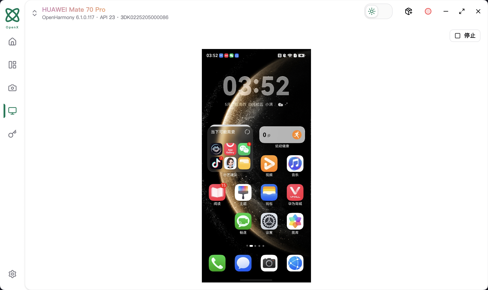
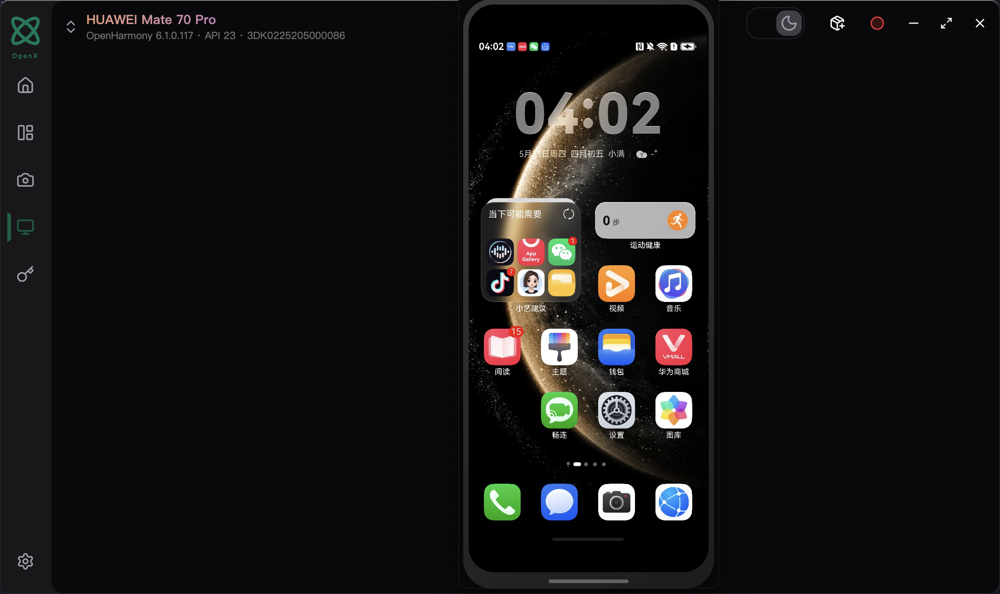
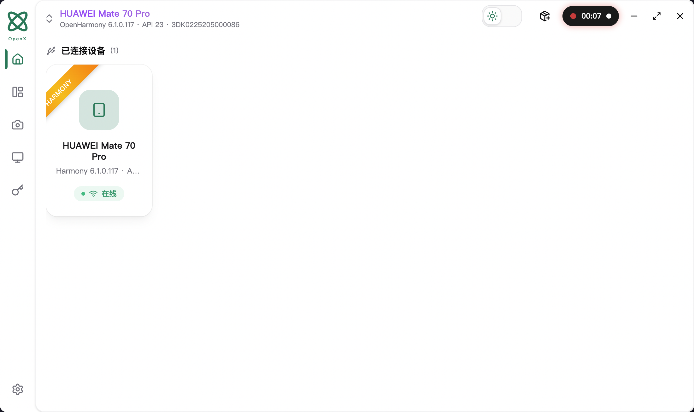
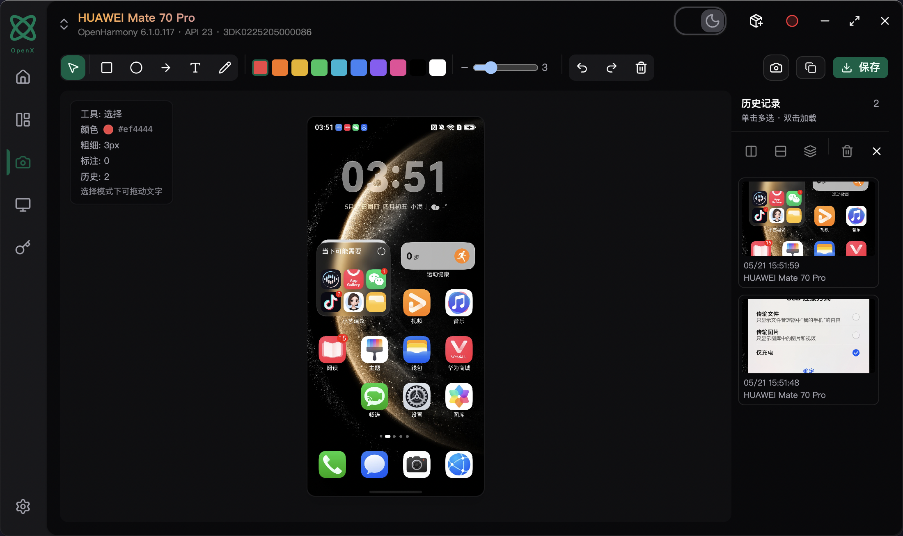
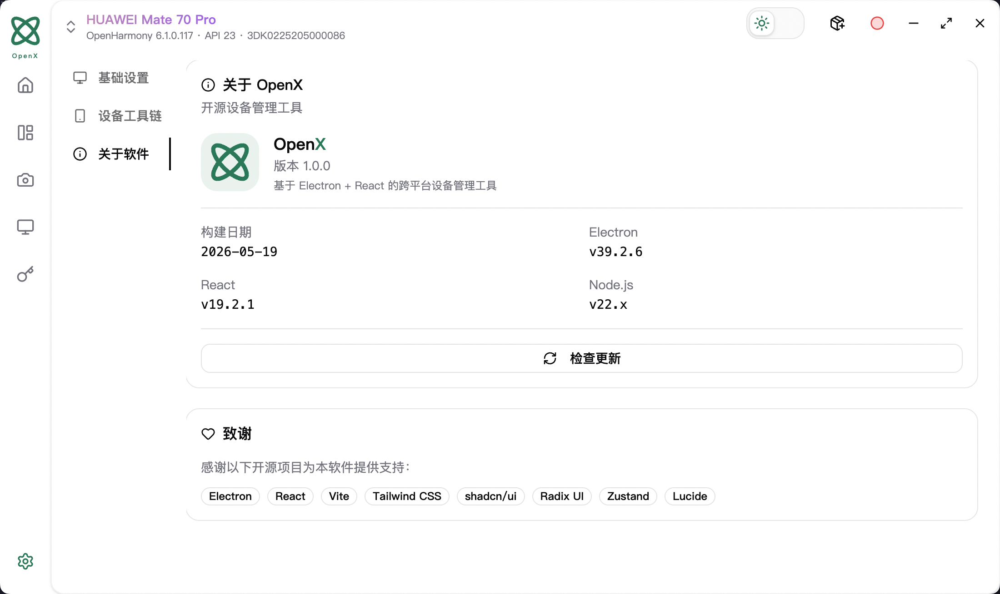

<div align="center">

# OpenX

> Android · HarmonyOS 设备管理桌面工具


</div>

OpenX 是一款面向移动研发与测试的桌面应用，支持 Android（ADB）与鸿蒙（HDC）双平台设备管理，提供屏幕镜像、截图编辑、录屏、应用管理等一站式功能，内置 scrcpy 实现超低延迟镜像。

---

## 功能预览

<table>
  <tr>
    <td align="center">
      <br/>
      <sub>屏幕镜像</sub>
    </td>
    <td align="center">
      <br/>
      <sub>截图编辑</sub>
    </td>
  </tr>
  <tr>
    <td align="center">
      <br/>
      <sub>应用管理</sub>
    </td>
    <td align="center">
      <br/>
      <sub>录屏</sub>
    </td>
  </tr>
  <tr>
    <td align="center">
      <br/>
      <sub>截图编辑</sub>
    </td>
    <td align="center">
      <br/>
      <sub>设置</sub>
    </td>
  </tr>
</table>

---

## 功能

| 功能 | Android | HarmonyOS |
|------|:-------:|:---------:|
| 设备发现与管理 | ✅ | ✅ |
| 截图 + 编辑标注 | ✅ | ✅ |
| 屏幕镜像（嵌入 / 独立弹窗） | ✅ scrcpy | ✅ UiDriver |
| 录屏（Dynamic Island 指示） | ✅ | — |
| 应用安装 / 卸载 / 启停 | ✅ APK | ✅ HAP |
| Shell 命令执行 | ✅ | ✅ |
| 全局变量管理 | ✅ | ✅ |

---

## 安装

```bash
npm install
npm run dev
```

打包发布：

```bash
npm run build:mac    # macOS
npm run build:win    # Windows
npm run build:linux  # Linux
```

---

## 工具包配置

打包后程序从 `resources/toolkit/` 加载随包工具，也可通过环境变量覆盖路径：

| 环境变量 | 说明 |
|----------|------|
| `OPENX_ADB_PATH` | 自定义 adb 路径（缺省使用系统 PATH） |
| `OPENX_HDC_PATH` | 自定义 hdc 路径（缺省查找 DevEco SDK） |
| `OPENX_SCRCPY_SERVER_PATH` | scrcpy-server.jar 路径（镜像/录屏必需） |

---

## 关键配置文件

| 文件 | 用途 |
|------|------|
| `electron.vite.config.ts` | 主进程 / 预加载 / 渲染层构建配置 |
| `electron-builder.yml` | 打包与签名配置 |
| `build/entitlements.mac.plist` | macOS 代码签名权限 |
